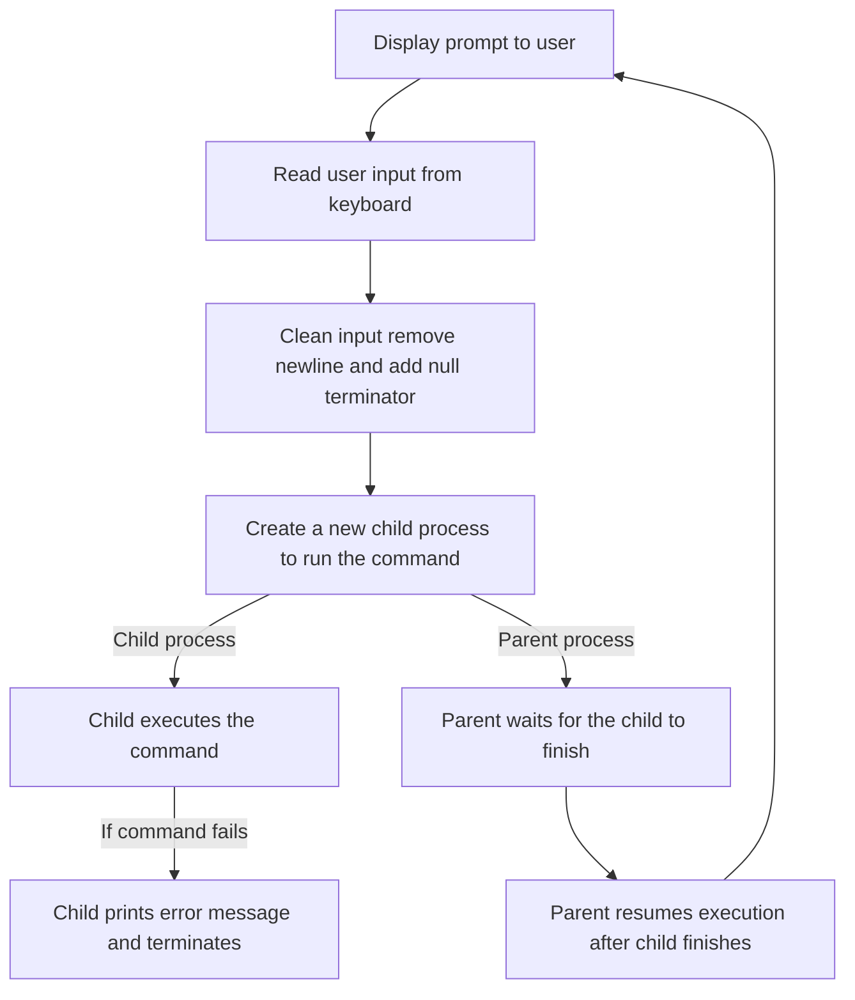
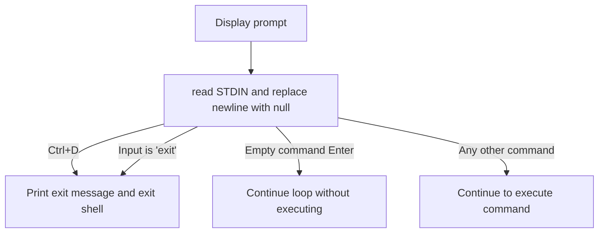
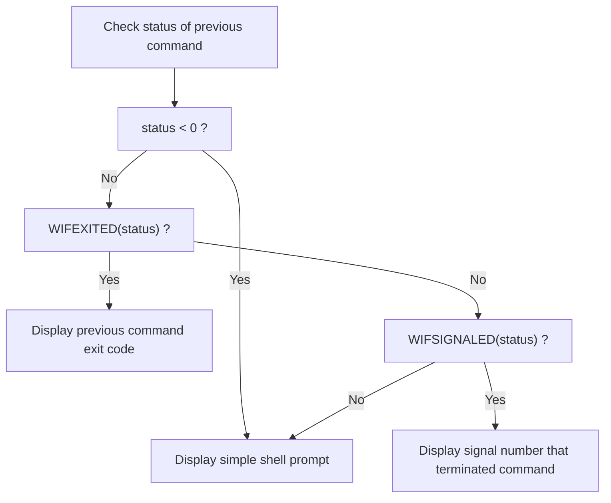

# TP PROGRAMMATION SYSTEME
#### CHERIFI Sacha
#### IDBAHA Maroua

This project implements a minimal Unix shell named **enseash**, developed incrementally through several questions.
Each step introduces core system programming concepts such as low-level I/O , process creation, and process termination handling.

## Question 1 — Welcome Message and Prompt Display

#### Objective:

At startup, the shell must:
- display a welcome message,
- indicate how to exit the shell,
- then show a prompt inviting the user to enter commands.

#### Implementation Principle:

This question focuses on **basic output handling** using low-level system calls.

- Output is written directly to **STDOUT** using `write()`.
- No higher-level I/O functions such as printf are used.
- No user input is processed at this stage.

#### Output


## Question 2 — Reading and Executing Simple Commands

#### Q2a — Reading User Input

The shell waits for user input using the system call :

```c
read(STDIN_FILENO, buffer, size);
```

**Key points:**
- Input is read from standard input (`STDIN`) using the `read()` system call.
- The number of bytes read is stored and checked to detect special cases (e.g. EOF).
- The newline character (`\n`) generated by pressing Enter is removed.
- The input buffer is converted into a valid C string by appending the null terminator (`\0`).
- Only simple commands without arguments are handled at this stage.

####  Q2b — Executing a Command

To execute a command, the shell relies on **process creation and execution** mechanisms provided by Unix systems.

The execution workflow is the following:

- `fork()` is used to create a **child process**
- The child process replaces its code using `execlp()` to execute the requested command
- The parent process waits for the child to terminate using `wait()`

This separation ensures that:
- the shell itself continues running,
- the executed command runs independently in the child process.

#### Q2c — Command Loop

The shell execution logic is implemented inside an infinite loop (`while(1)`) :

- The prompt is displayed at the beginning of each iteration
- User input is read and processed at each loop iteration
- Each command is executed independently in a child process
- After command execution, the shell returns to the prompt and waits for new input

This allows the shell to continuously process commands until it is explicitly terminated.

#### Summary



#### Output


#### Question 3 — Handling exit and Ctrl+D

#### Objective:
The shell must terminate cleanly in two cases:
- When the user enters the `exit` command.
- When `read()` returns `0`, indicating an end-of-file (Ctrl+D).

In both cases, the shell exits after displaying a termination message.

These conditions allow the shell to be closed in a controlled and predictable manner.

#### Summary


#### Output


## Question 4 — Displaying the Command Termination Status
#### Objective:

After executing a command, the shell updates its prompt to indicate how the previous command terminated.
The prompt format becomes:
```text
enseash [exit:N] %
```
where N represents the return code of the executed command.

#### Termination Analysis :

When a command finishes, the parent process retrieves its termination status using the system call:
```c
wait(&status);
```

Two termination cases exist in Unix systems :

1-  *Normal termination* : the command exits using return or exit().

2- *Termination by signal* : the command is interrupted by a signal (e.g. segmentation fault, kill).

#### Implemented Scope :
For now, only the normal termination case is implemented.
As a result:
- The shell displays the return code of commands that terminate normally.
- The termination by signal is not handled yet.


#### Summary



#### Output


